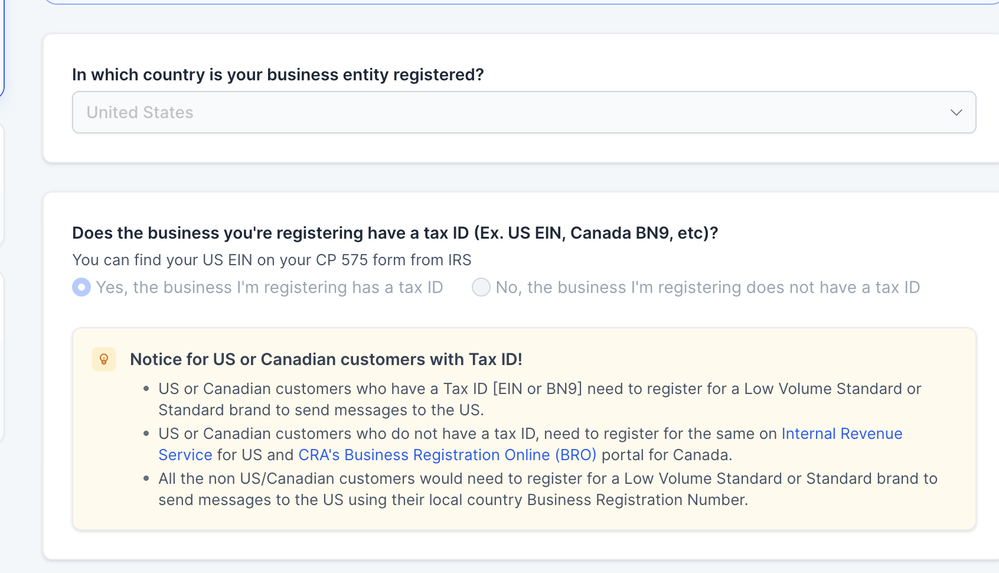
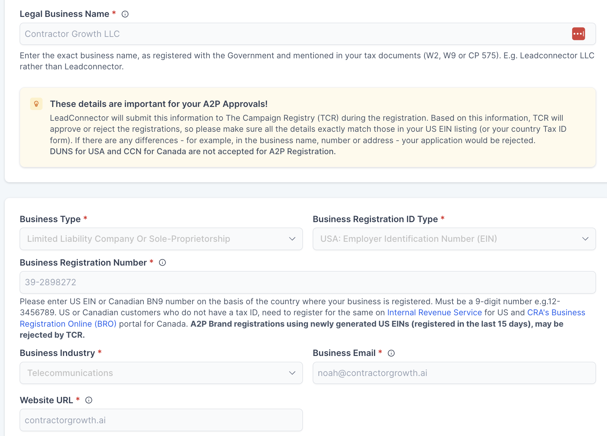
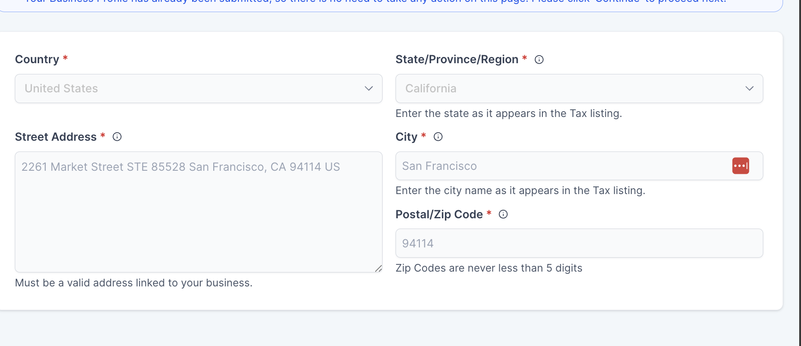
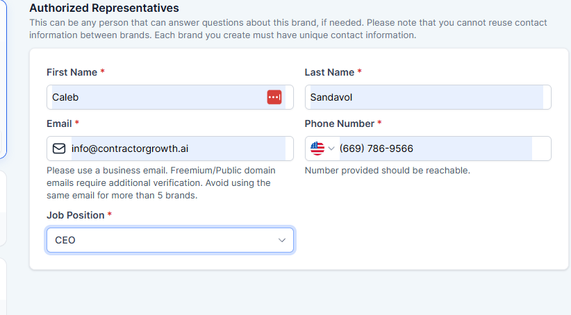
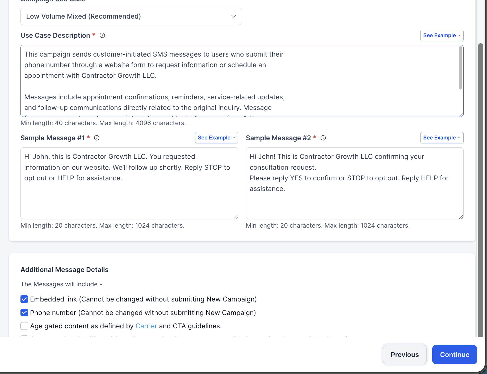
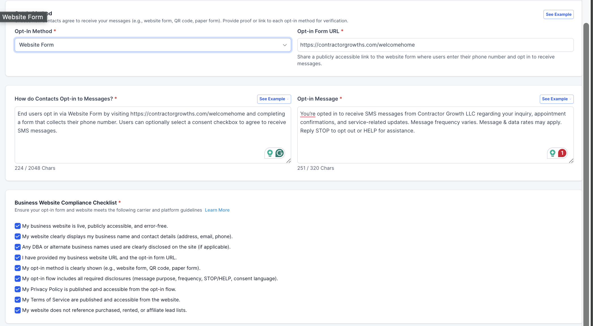

# A2P 10DLC Registration — Fill Guide

Work through this top-to-bottom with the registration form open. Every field below is copy-paste ready. Values come from the prior submitted brand + screenshots of the actual form.

> **Critical:** The business name, address, and EIN must match your IRS tax documents (W2, W9, CP 575) *exactly*. Any mismatch → TCR rejects the brand. Double-check before submitting.

---

## Step 1 — Business Registration Country & Tax ID

| Field | Value |
|---|---|
| Country of business registration | **United States** |
| Does the business have a tax ID? | **Yes, the business I'm registering has a tax ID** |

---

## Step 2 — Business Profile

| Field | Value |
|---|---|
| Legal Business Name | `Contractor Growth LLC` |
| Business Type | **Limited Liability Company or Sole-Proprietorship** |
| Business Registration ID Type | **USA / Employer Identification Number (EIN)** |
| Business Registration Number (EIN) | `39-2898272` |
| Business Industry | **Telecommunications** |
| Business Email | `noah@contractorgrowth.ai` |
| Website URL | `https://contractorgrowth.ai` |
| Business Region of Operations | **USA and Canada** |

> EIN must be at least 15 days old. Newly-generated EINs get rejected by TCR.

---

## Step 3 — Business Address

| Field | Value |
|---|---|
| Country | **United States** |
| State/Province/Region | **California** |
| Street Address | `2261 Market Street STE 85528 San Francisco, CA 94114 US` |
| City | `San Francisco` |
| Postal/Zip Code | `94114` |

> Must be a valid address linked to the business. Suite number (STE 85528) is required.

---

## Step 4 — Authorized Representative

| Field | Value |
|---|---|
| First Name | `Caleb` |
| Last Name | `Sandavol` |
| Email | `info@contractorgrowth.ai` |
| Phone Number | `+1 (669) 786-9566` |
| Job Position | **CEO** |

> Use the business email (not a gmail/yahoo). Phone must be reachable — they may call to verify.

---

## Step 5 — Brand Plan

| Field | Value |
|---|---|
| Brand Plan | **Standard** |

---

## Step 6 — Campaign / Use Case

| Field | Value |
|---|---|
| Use Case | **Low Volume Mixed (Recommended)** |

### Use Case Description (paste this exact text)

```
This campaign sends customer-initiated SMS messages to users who submit their phone number through a website form to request information or schedule an appointment with Contractor Growth LLC.

Messages include appointment confirmations, reminders, service-related updates, and follow-up communications directly related to the original inquiry. Message frequency varies based on user interaction and typically ranges from 1–3 messages per conversation.

Users may reply STOP to opt out or HELP for assistance at any time. Message and data rates may apply.
```

### Sample Message #1

```
Hi John, this is Contractor Growth LLC. You requested information on our website. We'll follow up shortly. Reply STOP to opt out or HELP for assistance.
```

### Sample Message #2

```
Hi John! This is Contractor Growth LLC confirming your consultation request. Please reply YES to confirm or STOP to opt out. Reply HELP for assistance.
```

### Additional Message Details (checkboxes)

- ☑ Embedded link *(cannot be changed without submitting a new campaign)*
- ☑ Phone number *(cannot be changed without submitting a new campaign)*
- ☐ Age-gated content *(leave unchecked)*

---

## Step 7 — Opt-In Method

| Field | Value |
|---|---|
| Opt-in Method | **Website Form** |
| Opt-in URL | `https://contractorgrowths.com/welcomehome` |

### How do Contacts Opt-in to Messages? (paste this)

```
End users opt in via Website Form by visiting https://contractorgrowths.com/welcomehome and completing a form that collects their phone number. Users can optionally select a consent checkbox to agree to receive SMS messages.
```

### Opt-in Message (paste this)

```
You're opted in to receive SMS messages from Contractor Growth LLC regarding your inquiry, appointment confirmations, and service-related updates. Message frequency varies. Message & data rates may apply. Reply STOP to opt out or HELP for assistance.
```

---

## Step 8 — Business Website Compliance Checklist

Check every box. Before submitting, verify each one is actually true on contractorgrowths.com/welcomehome:

- ☑ My business website is live, publicly accessible, and error-free.
- ☑ My website clearly displays my business name and contact details (address, email, phone).
- ☑ Any DBA or alternate business names used are clearly disclosed on the site (if applicable).
- ☑ I have provided my business website URL and the opt-in form URL.
- ☑ My opt-in method is clearly shown (e.g. website form, QR code, paper form).
- ☑ My opt-in flow includes all required disclosures (message purpose, frequency, STOP/HELP, consent language).
- ☑ My Privacy Policy is published and accessible from the opt-in form.
- ☑ My Terms of Service are published and accessible from the opt-in form.
- ☑ My website does not reference purchased, rented, or affiliate lead lists.

> If any of these is NOT true on the site right now → fix the site first, then submit. Missing Privacy Policy / Terms pages is the #1 reason forms get rejected.

---

## Pre-Submit Final Checks

1. Legal Business Name matches IRS CP 575 exactly (capitalization, LLC vs L.L.C., etc.)
2. EIN is 9 digits in format `XX-XXXXXXX` and at least 15 days old
3. Street address matches IRS filing (including STE 85528)
4. Website loads, has Privacy Policy + Terms links in footer, and the opt-in form actually collects phone with a consent checkbox
5. All sample messages contain brand name, STOP instructions, and HELP instructions

---

## Form Screenshots


*Country & Tax ID step*


*Business profile fields*


*Business address fields*


*Authorized Representative fields*


*Use case, description, sample messages*


*Opt-in method + compliance checklist*
